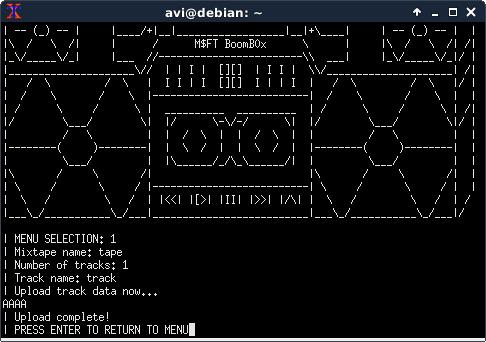
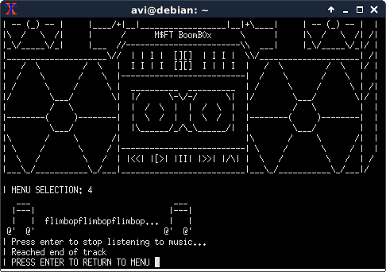
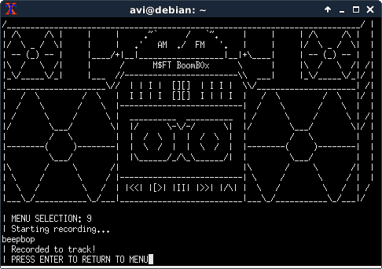
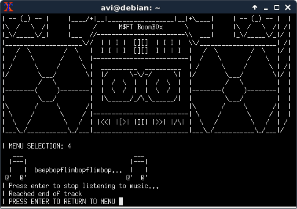
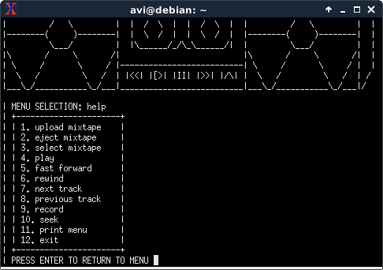
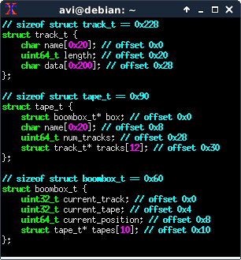
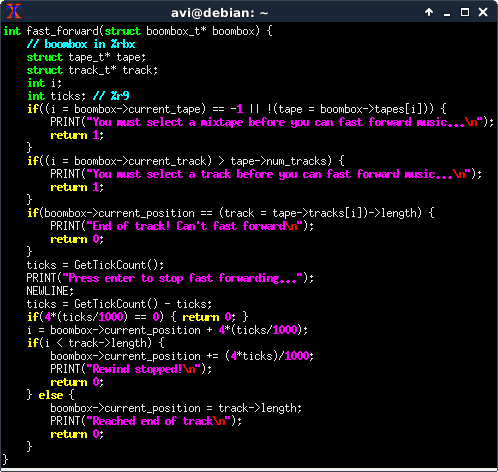
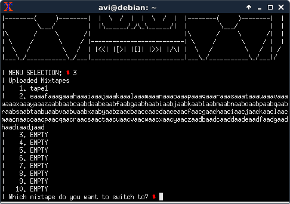
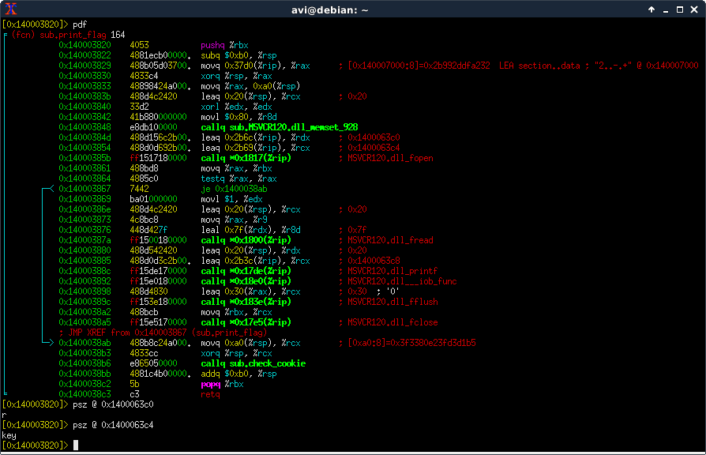
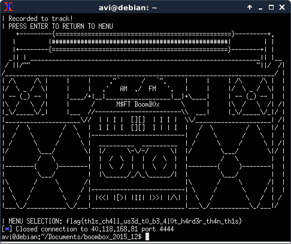

# CSAW Finals 2015 - Exploitation 500 `boombox`

## What `boombox` does normally
The `boombox` application allows non-malicious users to upload tapes consisting of a number of tracks of data.
It plays them by rendering them into a phonetic approximation of music.
Every 4 bits of the data are rendered into a phenome based on the following table:

<table>
<tr>
<td>0</td>
<td>1</td>
<td>2</td>
<td>3</td>
<td>4</td>
<td>5</td>
<td>6</td>
<td>7</td>
<td>8</td>
<td>9</td>
<td>A</td>
<td>B</td>
<td>C</td>
<td>D</td>
<td>E</td>
<td>F</td>
</tr>
<tr>
<td>beep</td>
<td>bop</td>
<td>zip</td>
<td>zam</td>
<td>flim</td>
<td>flam</td>
<td>ity</td>
<td>bad</td>
<td>do</td>
<td>dub</td>
<td>da</td>
<td>bez</td>
<td>um</td>
<td>yo</td>
<td>wop</td>
<td>bap</td>
</tr>
</table>
So for example, a track consisting of `"AAAA"` would get rendered as `flimbopflimbopflimbopflimbop` (since `'A' == 0x41`).

It also allows recording over the data at the current position of the tape, using the phenome representation as input.

There are also a number of management options:

* Ejecting (deleting) a tape
* Switching to another already-uploaded tape
* Fastforwarding/rewinding the current track
* Going to the next/previous track on the current tape
* Seeking to a bytewise offset on the current track

## Finding the vulnerability
My first thought was that the vulnerability would be a UAF, so I started off by reversing the upload/eject codepaths, which conveniently also involved discovering details of the data structures that `boombox` uses.
Sadly, all the input seemed to be handled cleanly in upload, and everything is freed and nulled correctly in eject.

The next place I looked was seek, to see if it had bounds checks (which it did).

The next obvious place for a vulnerability to be would be in record/play, as those are string handling functions.
`play` delegates to `render_music`, and `record` to `record_aux`.
Both helper functions take a length parameter, and both of them are passed something like `track->length - boombox->current_position`, which is only correct if you can never go past the end of a track, since the helpers use their length parameter unsignededly.

With the goal of finding a way to trigger an integer overflow in `record`, I looked at `fast_forward`, and found that it does a gimmicky calculation involving milliseconds until the enter key is pressed.

Note the difference between `4*(ticks/1000)` and `(4*ticks)/1000`.
Due to integer truncation, if ticks is 1500, the former evaluates as (`4*(1500/1000)` -> `4*1` -> `4`), while the latter evaluates as (`(4*1500)/1000` -> `6000/1000` -> `6`).
(This is similar in spirit to a class of vulnerabilities called Time-of-Check vs. Time-of-Use, or ToC/ToU for short.)
Since ticks is attacker-controlled (it's how long we wait to send a newline after), this means that it's possible to set the current position in the track to 2 past the end of the track.
This then results in `-2` being passed as a size to `record_aux`, being treated as obscenely large (integer overflow), and allowing a heap smash.

## Exploiting the vulnerability
There's a convenient `print_flag` function in `boombox.exe`, so the only thing needed to win is control of the instruction pointer and a `.text` segment address (assuming ASLR is on).

There's a `boombox_t` struct on the stack, and an attacker-influenced layout of `tape_t` and `track_t` on the heap.

My exploit:

1. Creates a tape with 2 tracks, and a tape with 1 track after it.\
At this point, the heap layout is `tape1 | track1 | track2 | tape2 | track3`\
`tape1`'s tracks array has pointers to `track1` and `track2`, and `tape2`'s has a pointer to `track3`
2. Seeks to near the end of the `track1`, and triggers the `fast_forward` ToC/ToU bug.
3. Uses `record` as a heap smash to set the `track2` length to be 1024 (increased from 512)\
The reason not to set it to something extreme like `2**64-1` is that `play` does a loop that reads up to the track's length (although it doesn't overflow the rendering buffer), and it needs to be practical to read the content of heap to find out where the stack is.
4. Using `track2`, reads the `box` pointer from `tape2` (it's set in `upload_mixtape`, but never used anywhere, so it's probably deliberate for exactly this purpose).
5. Uses `track2` to overwrite the `tape2->tracks[0]` to point at an offset into the boombox so that `tape2->tracks[0]->length` overlaps with the boombox's pointer to the second tape.
This orphans `track3`.\
As per the comment in step 3, this won't allow reading the stack, but it does allow controlled writes on the stack.
6. Uses the `tape2->tracks[0]` to create a "reasonable" length field after the boombox's tapes (overwriting something on the stack that's probably not important).\
It can't be created inside the boombox's tapes array, since that would result in a segfault when it tries to find the name of a tape using the length field as a pointer in `select_mixtape`.
7. Uses `track2` to overwrite the `tape2->tracks[0]` to use the "reasonable" length field on the stack created in step 6.
8. Uses `tape2->tracks[0]` to read main's return address, bypassing ASLR.
9. Uses `tape2->tracks[0]` to overwrite main's return address to point at an offset into `print_flag`.\
When I tried pointing it at `print_flag` directly, it segfaulted and didn't print out the flag.
At first, I had thought that I had used the wrong original address in the ASLR calculation, but when I tried using `print_boombox` and `print_menu`, those worked correctly. I tried skipping `print_flag`'s stack cookie initialization (by using `print_flag+0x1b`) on the hunch that "maybe it's writing to the stack wrongly somehow", and it printed out the flag before segfaulting.

## Disclaimer
I wasn't fast enough to solve this during CSAW Finals.
The challenge's author sent it to the RPISEC mailing list over winter break, soliciting writeups for it.
